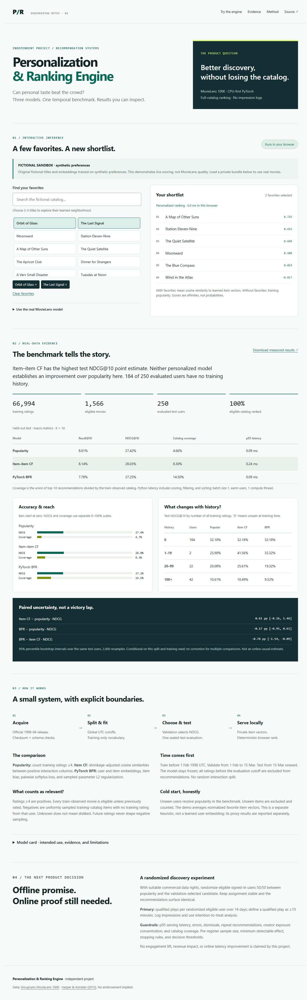
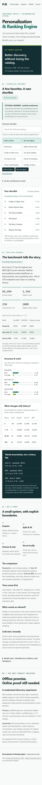

# Personalization & Ranking Engine

**Independent portfolio project · Python · PyTorch · Recommendation systems**

Can personalized recommendations outperform popularity while preserving useful catalog coverage and reasonable latency? This project answers with a real MovieLens 100K run, a temporal benchmark, and a static browser demo.

**Finding:** item CF has the highest test NDCG, but its paired interval against popularity includes zero. BPR increases coverage and has low measured scoring latency, yet does not beat popularity on test ranking quality. No engagement or revenue lift is claimed.



## Measured results

Full eligible-catalog ranking, K=10, 250 eligible test users, 1,566 train-observed movies. Macro average over users. Same candidates and exclusions for every model.

| Model | Recall@10 | NDCG@10 | Catalog coverage | p50 / p95 CPU latency |
|---|---:|---:|---:|---:|
| Popularity | 0.08006 | 0.27423 | 4.66% | 0.0455 / 0.0899 ms |
| Item–item CF | 0.08137 | 0.28031 | 8.30% | 0.1694 / 0.2400 ms |
| PyTorch BPR | 0.07781 | 0.27249 | 14.50% | 0.0639 / 0.0898 ms |
| Favorite-vector fold-in (separate demo proxy) | 0.07439 | 0.26568 | 15.45% | 0.2286 / 0.2872 ms |

Paired 95% bootstrap NDCG differences (2,000 user resamples):

- Item CF − popularity: **+0.00607**, interval **[−0.00164, +0.01463]**.
- BPR − popularity: **−0.00174**, interval **[−0.00946, +0.00605]**.
- BPR − item CF: **−0.00782**, interval **[−0.01545, −0.00092]**.

**184/250 test users (73.6%) have no training history** and receive the same popularity fallback. Only 66 have training history. The 1–19-history cohort has two users and is not reliable evidence for a product decision. Intervals condition on one training seed and one temporal split, with no multiple-comparison correction.

Results, all cohort metrics, hardware, exclusions and provenance: [metrics.json](reports/full/metrics.json). Hyperparameter trials: [selection.json](reports/full/selection.json). The recorded Windows 11 / AMD64 run used Python 3.12.14, NumPy 2.2.6, PyTorch 2.8.0 CPU, one BLAS/PyTorch thread, batch size one, 20 warmups, and 300 timed requests cycling warm users. Timing includes scoring, consumed-item filtering, and sorting; excludes startup, network, disk, and UI rendering. These are microbenchmarks, not serving SLOs.

## Run locally

Requires Python 3.12 and Node 22+ for JavaScript parity tests. The website itself has no npm dependencies.

```bash
python -m venv .venv
# macOS/Linux
source .venv/bin/activate
# Windows PowerShell: .\.venv\Scripts\Activate.ps1
python -m pip install -r requirements.txt --extra-index-url https://download.pytorch.org/whl/cpu
python -m pip install -e . --no-deps
```

Use a single compute thread to match measured latency:

```bash
# macOS/Linux
export OPENBLAS_NUM_THREADS=1 OMP_NUM_THREADS=1
# PowerShell:
# $env:OPENBLAS_NUM_THREADS='1'; $env:OMP_NUM_THREADS='1'

# Quick real-data smoke run (separate from the published benchmark)
python -m ranking.run --config configs/smoke.json --output reports/smoke --artifacts artifacts/smoke

# Reproduce the full benchmark in a fresh output directory
python -m ranking.run --config configs/full.json --output reports/reproduction --artifacts artifacts/reproduction

python -m pytest -q
node --test tests/scorer.test.mjs
python scripts/build_site.py
python -m http.server 8765 --directory dist
```

Open `http://localhost:8765`. Training downloads the official archive and checks its published MD5, then records SHA-256. It never uses dataset demographics. The report directory refuses to overwrite a completed test run. Reproduction is an audit, not permission to tune on the recorded test set. CPU/GPU, platform, library, and BLAS differences can change low-order floating-point values and rankings at ties.

On managed Windows with a corporate certificate store, `--system-certificates` enables pip's vendored truststore. TLS verification remains enabled. To run parity tests when Node is not on PATH, set `NODE_BINARY` to its executable. The exact measured Python environment is in [requirements-measured.txt](requirements-measured.txt); `requirements.txt` pins the direct dependencies for portable installation.

### Real MovieLens recommendations

1. Train locally as above.
2. In the site, expand **Use the real MovieLens model**.
3. Select `artifacts/reproduction/private-bundle.json` (or the original `artifacts/full/private-bundle.json` in the delivered local checkout).
4. Search real movies, select favorites, and see deterministic recommendations. Favorites are excluded.

The bundle is processed in memory with no upload or browser persistence. The public default uses **30 original fictional movie titles** and embeddings actually trained on **300 synthetic taste profiles**. This sandbox is for interaction only; no synthetic results appear in the MovieLens benchmark. Regenerate it with `python scripts/train_sandbox.py`.

The public demo does **not** bundle MovieLens data, metadata, or learned vectors. This is a deliberate licensing constraint, not a claim that fictional titles are real MovieLens recommendations. Local inference also works from the CLI:

```bash
python -m ranking.infer artifacts/reproduction/private-bundle.json --favorites 1 50 100
```

## Architecture


| Directory | Purpose |
|---|---|
| `src/ranking/` | Acquisition, preprocessing, models, ranking, evaluation, export, CLI inference |
| `configs/` | Committed full/smoke configurations |
| `reports/full/` | Actual aggregate results and model-selection audit |
| `site/` | Accessible responsive demo; shared JS scorer; original fictional assets |
| `tests/` | Temporal, metric, candidate, negative-sampling, determinism, export checks |
| `scripts/` | Allowlisted site build, fictional training, independent metric audit |
| `data/`, `artifacts/` | Private, ignored source data and trained assets |
| `.github/workflows/` | Real-data smoke CI and GitHub Pages deployment |

## Methodology and boundaries

- **Train:** timestamps strictly before 1998-02-01 00:00 UTC (66,994 ratings).
- **Validation:** 1998-02-01 inclusive to 1998-03-15 exclusive (15,079 ratings).
- **Test:** 1998-03-15 onward (17,927 ratings; source ends April 1998).
- **Positive:** rating ≥4. All prior ratings, including 1–3, count as consumed.
- **Eligibility:** any movie observed in training; future-only movies have no fitted representation and are excluded for all models. No sampled evaluation candidates.
- **Frozen snapshot:** no train+validation refit; validation consumption filters test candidates but does not update model parameters or taste profiles. This avoids hidden protocol changes and understates what a regularly refreshed service might do.
- **Targets:** future positives among eligible unseen candidates. Users with no eligible targets are excluded from macro metrics. Test excludes 232 positive interactions on train-unseen movies and seven positive-rating users with no eligible targets.
- **Model selection:** validation macro NDCG@10; deterministic first-trial tie break. CF shrinkage `[0,20,100]` selected `0`. BPR dimensions `[16,32]`, epoch checkpoints `[10,30,60]` selected **32 dimensions / 10 epochs**, validation NDCG 0.26921. BPR led validation; item CF led test. Test results did not change selection or hyperparameters.
- **BPR:** `s(u,i)=Uu·Vi+bi`; mean `softplus(-(s(u,i)-s(u,j)))` plus L2 on sampled U/V/bias rows. Adam LR 0.01, λ=0.0001, batch 2048, seed 42. One uniformly sampled unconsumed train-catalog negative per positive per epoch. Unknown items are not confirmed dislikes; the objective uses a surrogate pairwise preference.
- **New users:** popularity fallback. Train users with no positive history also get popularity. Movies observed only with low ratings remain eligible: CF gives them zero similarity and BPR only negative evidence; this is a limitation, not a reason to leak future positives into preprocessing.
- **Demo:** average unit-normalized favorite vectors and take dot products with unit-normalized candidate vectors. No fitted user vector or item bias. A separate `favorite_fold_in` proxy uses all positive training favorites; it does not measure a 2–5-favorite onboarding session. It underperforms popularity here.

Ratings are **not impression logs**; unobserved is **not disliked**. This historical cohort is self-selected, biased toward active raters and exposed films, and not representative of today's audience. Offline ranking metrics cannot establish business engagement, causal lift, calibration, fairness, or commercial viability.

## Data rights and attribution

Source: [GroupLens MovieLens 100K, stable release 1998-04](https://grouplens.org/datasets/movielens/100k/). [Official usage terms and schema](https://files.grouplens.org/datasets/movielens/ml-100k-README.txt) reviewed 2026-09-23. Research use requires attribution; redistribution and commercial/revenue-bearing use require separate permission. This repository conservatively withholds derived model bundles too because the terms do not explicitly settle their publication. No posters, demographic data, or user embeddings are published. See [data governance](docs/data-governance.md).

Citation: F. Maxwell Harper and Joseph A. Konstan. 2015. *The MovieLens Datasets: History and Context*. ACM TiiS 5(4), Article 19. [doi:10.1145/2827872](https://doi.org/10.1145/2827872). No University of Minnesota or GroupLens endorsement is implied.

Original code, prose, fictional titles, and fictional sandbox assets are licensed under MIT. MovieLens and its derived private assets are not covered by that license.

## Review material

- [Analysis walkthrough](docs/walkthrough.md)
- [Product and technical decision memo](docs/decision-memo.md)
- [Model card](docs/model-card.md)
- [Interview guide](docs/interview-guide.md)
- [Three defensible resume bullets](docs/resume-bullets.md)
- [Verification record](docs/verification.md)
- [Deployment instructions](docs/deployment.md)


